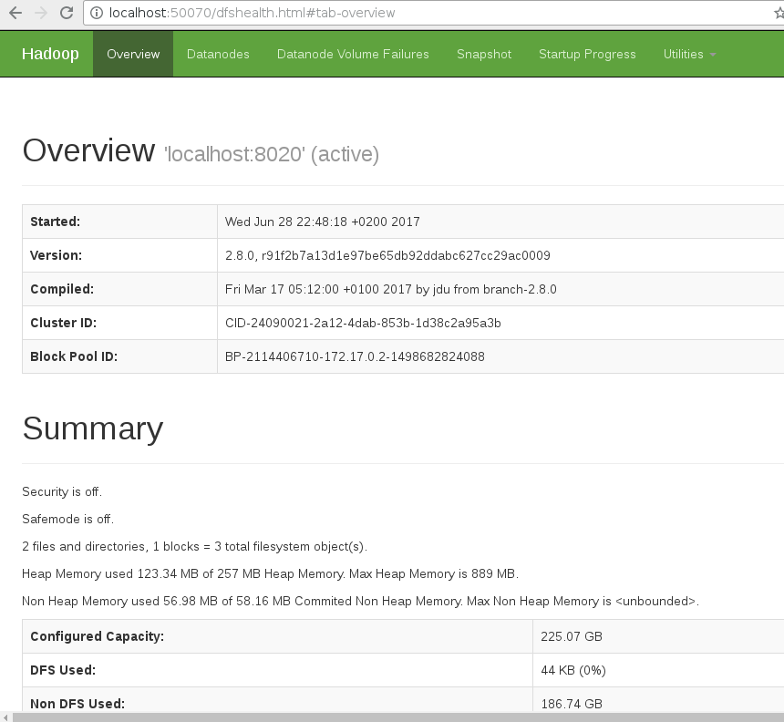

# imixs-docker/hadoop

The Docker Image 'imixs-docker/hadoop' provides a Docker image to setup a single node hadoop clust. This container can be used to test the hadoop WebHDFS Rest API. The image is based on the [official openjdk:8 Docker image](https://hub.docker.com/r/_/openjdk/).

The 'imixs-docker/hadoop' provides the following features:

## Features
* inherit form officeal openJDK
* runs hadoop with OpenJDK 8
* starts a single node hadoop cluster
* support WebHDFS Rest API
* installation path: /opt/hadoop 
* linux user: imixs

The Imixs-hadoop system is typically protected from external access. For that reason no kerberos security module is part of this image.

## WebHDFS – Rest API

Apache Hadoop provides a high performance native protocol for accessing HDFS. While this is great for Hadoop applications running inside a Hadoop cluster, external applications typically need to connect to HDFS from the outside. Usining the native HDFS protocol means installing Hadoop and a Java binding with those applications. To access the hadoop cluster without these libraries a standard RESTful mechanism, called WebHDFS can be used. As part of this, WebHDFS takes advantages of the parallelism that a Hadoop cluster offers. Further, WebHDFS retains the security that the native Hadoop protocol offers. It also fits well into the overall strategy of providing web services access to all Hadoop components. Read also the official documentation of the Hadoop [WebHDFS REST API](https://hadoop.apache.org/docs/r2.8.0/hadoop-project-dist/hadoop-hdfs/WebHDFS.html).

# 1. Install Docker
Follow the [Docker installation instructions](https://docs.docker.com/engine/installation/) for your host system.

# 2. Running and stopping a container
The container includes a start script which allows to start Hadoop and Wildfly. You can start the container with the Docker run command:

    docker run --name="hadoop" -d -p 9000:9000 -p 50070:50070 -p 50075:50075  imixs/hadoop
    
or interactive:

    docker run --name="hadoop" -it -p 9000:9000 -p 50070:50070 -p 50075:50075  imixs/hadoop

To stop and remove the Docker container run the Docker command:

    docker stop hadoop && docker rm hadoop

# 3. Testing 

You can access the hadoop Web Interface from your browser:

	http://localhost:50070/ 

To test the hadoop file system, first create a test file.
Start a bash in the running container:

	docker exec -it hadoop /bin/bash	

Next create and read a file:

	root@3960dc1b946c:/opt# for((i=0; i<10; i++)) do echo ${i}; done > test.log
	root@3960dc1b946c:/opt# hdfs dfs -copyFromLocal test.log /
	root@3960dc1b946c:/opt# hdfs dfs -ls /
	Found 1 items
	-rw-r--r--   1 root supergroup         20 2017-06-28 20:51 /test.log
	

You will see the output in the hadoop log file and the new created file:

## Testing the WebHDFS Rest API

To test the Rest API you can run the culr command from inside the container:

	curl -i -L "http://localhost:50070/webhdfs/v1/test.log?op=OPEN"

This curl command follows the Temporary Redirect response to a datanode and obtains the file data with the following response:

	HTTP/1.1 307 TEMPORARY_REDIRECT
	Cache-Control: no-cache
	Expires: Wed, 28 Jun 2017 20:56:28 GMT
	Date: Wed, 28 Jun 2017 20:56:28 GMT
	Pragma: no-cache
	Expires: Wed, 28 Jun 2017 20:56:28 GMT
	Date: Wed, 28 Jun 2017 20:56:28 GMT
	Pragma: no-cache
	Content-Type: application/octet-stream
	X-FRAME-OPTIONS: SAMEORIGIN
	Location: http://3960dc1b946c:50075/webhdfs/v1/test.log?op=OPEN&namenoderpcaddress=localhost:8020&offset=0
	Content-Length: 0
	Server: Jetty(6.1.26)
	
	HTTP/1.1 200 OK
	Access-Control-Allow-Methods: GET
	Access-Control-Allow-Origin: *
	Content-Type: application/octet-stream
	Connection: close
	Content-Length: 20
	
	0
	1
	2
	3
	4
	5
	6
	7
	8
	9
	root@3960dc1b946c:/opt# 

# Contribute
The source is available on [Github](https://github.com/imixs/imixs-docker). Please [report any issues](https://github.com/imixs/imixs-docker/issues).

Checkout the sources from GitHub:

	git clone https://github.com/imixs/imixs-docker.git 
	git checkout -b master origin/master

To build the image from the Dockerfile run: 

    docker build --tag=imixs/hadoop ./hadoop

To log into the container, start it and run:
    
    docker exec -it hadoop /bin/bash	

To remove the image run

	docker stop hadoop
	docker rmi imixs/hadoop

	
	
